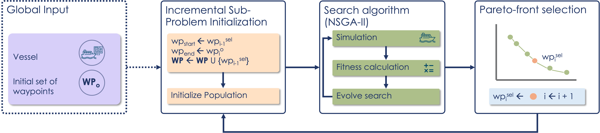

# IncWP: Incremental Waypoint Search

This repository contains the MATLAB code used in the paper for incremental waypoint search, experiment replay, and result analysis for autonomous vessels.

This repository supports three main tasks:

1. Running waypoint-generation experiments.
2. Replaying selected experiments from shared zip data.
3. Running the analysis on original or replayed results.

## Approach Overview

The paper proposes `IncWP`, an incremental multi-objective waypoint search for testing waypoint-guided autonomous vessels. Instead of evolving the full waypoint set at once, the approach fixes previously selected waypoints and only evolves the current waypoint segment. This reduces simulation cost, lowers failure-detection latency, and allows early navigation failures to be explored before the search spends time on later waypoints.



Selection methods are `IncWP_KP`, `IncWP_Unst`, `IncWP_Prox`, `IncWP_Rnd`, `RandomSearch`, `IncWP_Kmeans`, and `FullWP`. Supported vessel names are `remus100`, `nspauv`, and `mariner`.

## Setup

Clone this repository:

```bash
git clone https://github.com/Karolinenylaender/WPgen-extended.git
```

Clone the external frameworks used by the project:

```bash
git clone https://github.com/cybergalactic/MSS.git
git clone https://github.com/BIMK/PlatEMO.git BIMK-PlatEMO-4.7.0.0
```

The adapted `NSGA-II-Adapted` code used by this project is tracked in this repository under `frameworks/evolutionaryPlatform/NSGA-II-Adapted`.

Dependencies and licensing:

- `MSS` by Thor I. Fossen and contributors
- `PlatEMO` by the BIMK Group
- the adapted `NSGA-II-Adapted` code used in this repository

Place the downloaded folders either:

- directly in the repository root as `MSS`, `BIMK-PlatEMO-4.7.0.0`, and `NSGA-II-Adapted`, or
- already inside `frameworks/MSS` and `frameworks/evolutionaryPlatform`

Open MATLAB in the repository root and run:

```matlab
setupProject
```

`setupProject` adds the required MATLAB paths, moves the framework folders into `frameworks/` if needed, and creates the `experimentsData`, `replicationRuns/experiments`, and `replicationData` folder structure used by the project.

If the framework folders are placed in the repository root, `setupProject` moves them into:

- `frameworks/MSS`
- `frameworks/evolutionaryPlatform/BIMK-PlatEMO-4.7.0.0`
- `frameworks/evolutionaryPlatform/NSGA-II-Adapted`

## Running Experiments

The main experiment entry script is [runExperiments.m](scripts/runExperiments.m). The approach implementations are in [scripts/approaches](scripts/approaches). After `setupProject`, the repository is ready to run and `resultsPath` should point to `experimentsData`.

To run one standard incremental waypoint experiment directly:

```matlab
vesselName = "remus100";
selectionType = "IncWP_KP";
experimentNumber = 1;
numGenerations = 1000;
populationSize = 10;
resultsPath = "experimentsData";

runIncWP(vesselName, selectionType, resultsPath, experimentNumber, numGenerations, populationSize)
```

Important options:

- `vesselName`: `remus100`, `nspauv`, or `mariner`.
- `selectionType`: `IncWP_KP`, `IncWP_Unst`, `IncWP_Prox`, `IncWP_Rnd`, or `IncWP_Kmeans`.
- `resultsPath`: explicit output folder path, normally `experimentsData`.
- `experimentNumber`: experiment identifier.
- `numGenerations`: default is `1000`.
- `populationSize`: default is `10`.

### Approach Variants

The table below links the paper naming, MATLAB naming, and the script used to run each approach in [scripts/approaches](scripts/approaches).

| Paper name | MATLAB selection string | Run function | Meaning |
| --- | --- | --- | --- |
| `IncWP_KP` | `IncWP_KP` | `runIncWP(..., "IncWP_KP", ...)` | Selects the knee point of the Pareto front, representing a compromise between proximity to the original waypoint and path instability. |
| `IncWP_Unst` | `IncWP_Unst` | `runIncWP(..., "IncWP_Unst", ...)` | Selects the individual with the highest instability objective value to prioritize failure-revealing paths. |
| `IncWP_Prox` | `IncWP_Prox` | `runIncWP(..., "IncWP_Prox", ...)` | Selects the individual closest to the original waypoint, prioritizing realistic and minimal waypoint changes. |
| `IncWP_Rnd` | `IncWP_Rnd` | `runIncWP(..., "IncWP_Rnd", ...)` | Selects one reachable Pareto-front individual at random. |
| `IncWP_Kmeans` | `IncWP_Kmeans` | `runIncWPKmeans(...)` | Selects multiple starting waypoints using clustering over the final population. |
| `RandomSearch` | `RandomSearch` | `runRandomSearch(...)` | Random incremental baseline without guided evolutionary selection. |
| `FullWP` | `FullWP` | `runFullWP(...)` | Full waypoint-set search that evolves the complete waypoint sequence at once. |

The first five rows are the `IncWP` family. `RandomSearch` and `FullWP` are the baselines used in the paper.

## Code Structure

[scripts](scripts)  
Main experiment code. This folder contains the approach entry points in `approaches/`, the search and simulation logic in `vesselSearch/`, and the top-level experiment runner in [runExperiments.m](scripts/runExperiments.m).

Important subfolders:
- `approaches`: entry points for `IncWP`, `IncWP_Kmeans`, `RandomSearch`, and `FullWP`
- `vesselSearch/incrementalSearch`: incremental waypoint search and path simulation
- `vesselSearch/globalSearch`: full waypoint-set search and evaluation code
- `vesselSearch/helpers`: shared helper functions used by the search code

[analysis](analysis)  
Analysis pipeline for processing experiment outputs and reproducing the reported metrics and figures.

Important subfolders:
- `dataProcessing`: loads raw experiment outputs and restructures them for later analysis
- `metric`: computes the reported metrics and statistical summaries
- `displayFunctions`: plotting and result-display helpers used by the analysis code

[replication](replication)  
Scripts for unpacking the tracked replication data and rerunning the missing simulation outputs.

[replicationData](replicationData)  
Tracked publication data, including the packaged experiment zip files and zipped analysed results.

[frameworks](frameworks)  
External frameworks used by the project, including the adapted evolutionary platform and MSS.

## Analysis

Use [runAnalysis.m](analysis/runAnalysis.m) to analyse either original experiment data or replayed data.

For the original experiment data:

```matlab
runAnalysis("remus100", "experimentsData")
```

For replayed data:

```matlab
runAnalysis("remus100", "replicationRuns/experiments")
```

## Replication

Use the replication workflow only when you want to rerun the packaged experiment data. The tracked experiment zip files are stored under `replicationData/zippedExperiments/`. The path-simulation files are too large to include directly, so `runReplication` unzips the packaged data and reruns those simulation outputs locally.

To rerun the replication data:

```matlab
runReplication
```

`runReplication` imports the tracked experiment zip files, reruns the simulations in `replicationRuns/experiments/`, and then runs the analysis on the replayed outputs.

### Dependencies

This project uses third-party code from:

- `PlatEMO`, developed by Ye Tian, Ran Cheng, Xingyi Zhang, Yaochu Jin, and the BIMK Group
- `MSS` (Marine Systems Simulator), developed by Thor I. Fossen and contributors
- `knee_pt`, developed by Dmitry Kaplan

We do not own those components. Keep their license files, notices, and requested citations when redistributing or publishing from this repository.
